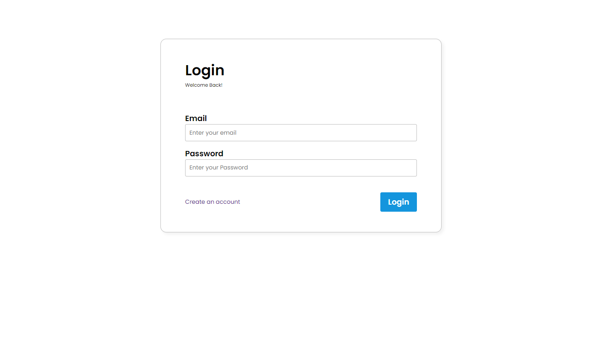
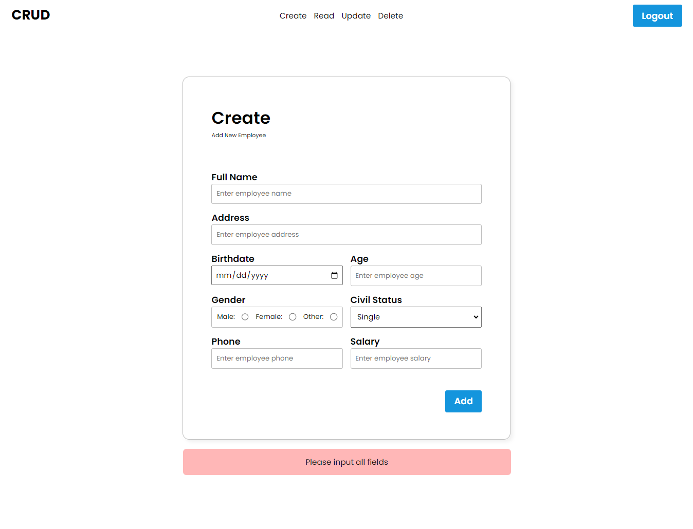
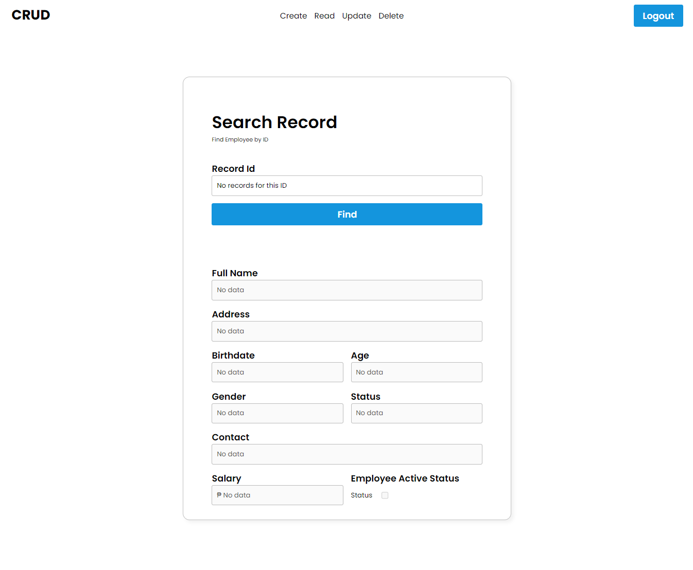
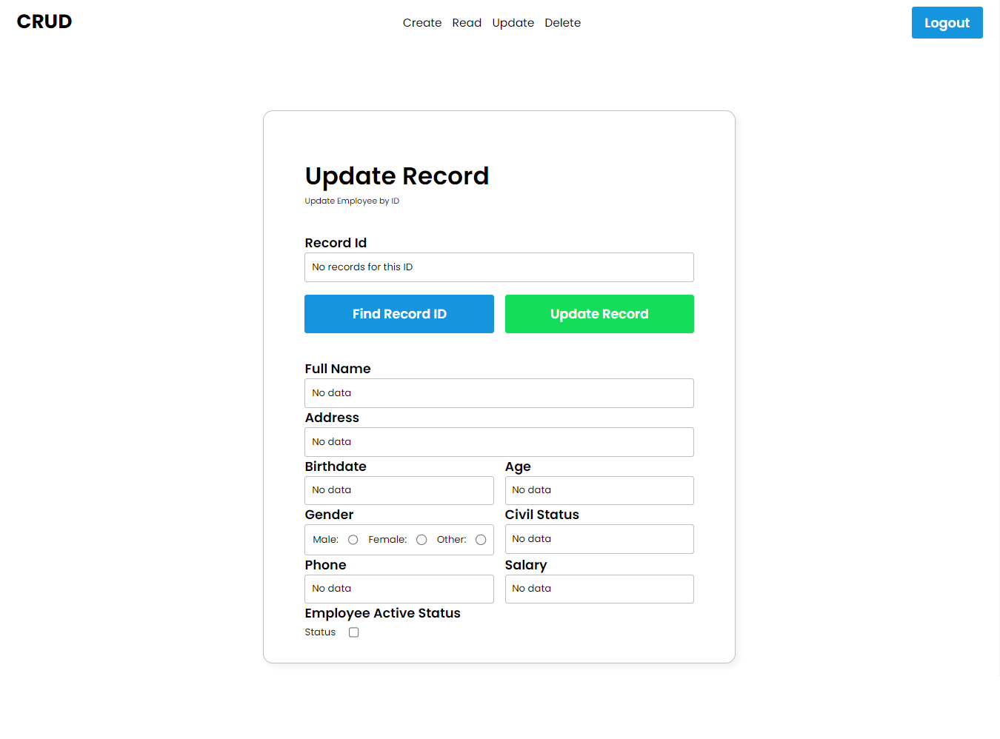
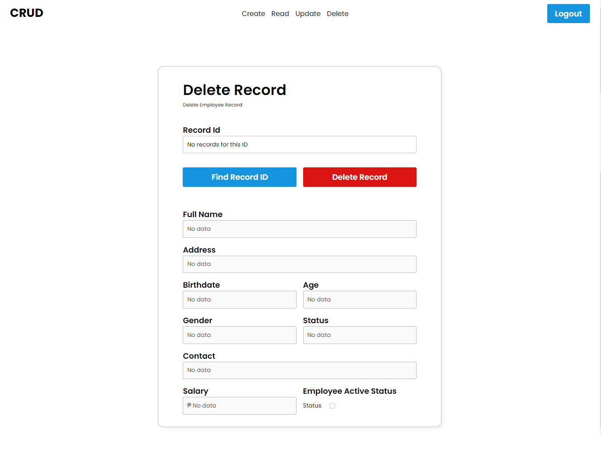

# LOGIN - CRUD PHP

[UI Design Figma](https://www.figma.com/file/nlOywJOKwlVLUSQuyP3wvN/Login-%2F-CRUD---PHP?type=design&node-id=0-1&mode=design&t=khX1MiYc7J0Llzdo-0)  
[Screen Recordings](https://drive.google.com/drive/folders/1AUHl9NwpAia-Uf99KBNV2b7tLXZkxnlt)  

#### Login Page   

#### Register Page   

#### CRUD - Create   

#### CRUD - Read/Find   

#### CRUD - Update   

#### CRUD - Delete   

